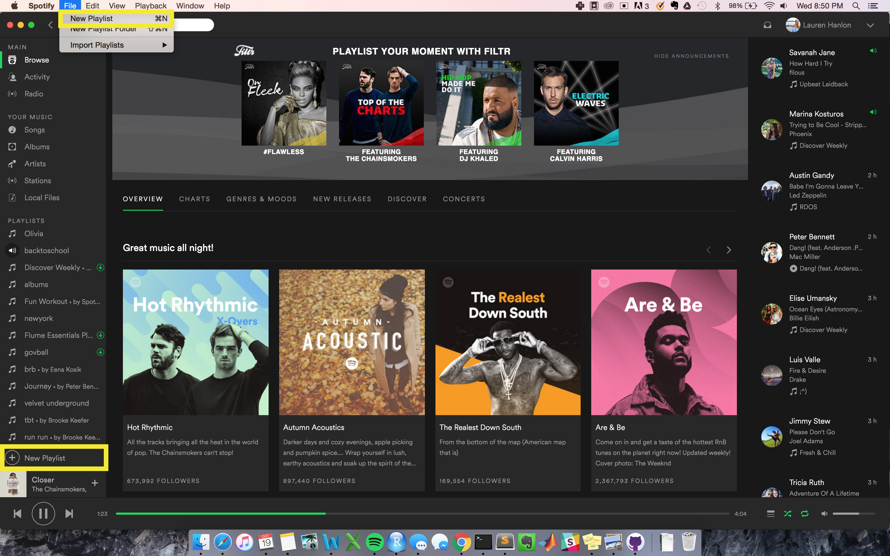

### Methodology

I decided to split up the questions into three different tasks: Organization, Exploration and Social that could determine the different user needs within the music platform. 

Completed three usability tests where one person with a note-taker, recorder and I served as the moderator.

I recruited participants with different prior knowledge of the platform (from novice to premium user) to complete a series of tasks. During the three trials, I guided the user through the set of tasks, making sure to convey the task objective without providing too much guidance on how the task was to be carried out. This allowed the the notetaker to keep a log of the user’s stream-of-consciousness commentary on their actions in addition to their navigation choices.

---

### Description of what I tested

I focused on evaluating Spotify’s functionality across several use cases: organizing music, exploring music, and engaging with other Spotify users in a social manner. I paid close attention to how the design of the platform guided the users steps in completing the tasks and sought to identify how the experience-level of the user affected their navigation on the platform.

---

### Test Guide

#### Test Logistics

- 1 Moderator (me)
- 1 Notetaker/Session recorder

#### Target Participant Criteria:

- Tech savvy university students
- A range of experience-levels (super knowledgeable user, moderate spotify users,
new user)
- Mix of premium and standard users (all operating in the premium environment)

#### Testing Goals: determine how well Spotify addresses varying user needs

- Organization of Music
- Exploration and Discovery of new music
- Social Engagement

#### Questions

_Organization_

1. Create a new playlist 
2. Title it
3. Add 5 songs, from at least 2 different genres
4. Put this playlist in "Offline Mode"

_Exploration_

5. Find three new songs you didn't know about, add to playlist

_Social_

6. Enable private session
7. Find a song from a friend's playlist and add it to your playlist from earlier

---

### User Testing

#### Organization

*Create a playlist*

The first task I asked all participants to accomplish was making a new playlist and titling it. 

The first two participants (one experienced, one new user) were able to quickly locate the “+ New Playlist” button on the left hand side of the platform, creating and titling the playlist with great ease. This feature seemed clearly intuitive in its design and location, allowing a user who had never opened Spotify before to accomplish the task as comfortably as the seasoned user.

The third participant (new user) actually created a new playlist by clicking the upper “File” tab then selecting “New Playlist.” When reviewing the results with her, _I found that the “New Playlist” button on the left hand side is not labeled very clear, and might not be as intuitive for non-Spotify users._

```{r, out.width = "800px", echo=FALSE, fig.align="center"}

```

*Add 5 songs to the playlist, from two different genres*

When browsing for songs to add to the playlist, the first user (experienced) commented that she uses the “Song” folder to store music that she likes and wants to refer back to. Thus, this is the first place she went to search for music to add to her playlist. She commented that by saving songs in this fashion she is able to narrow the range of her search whenever she creates playlists, but that the music under “Songs” is in a sort of trial stage -- not yet in a playlist, but saved in some way.

The second user (new user) did not seem to understand the role of “Songs” in the same way as the experienced user, however, she did end up browsing through songs to see what was there.

When I asked the third user (new user) to add songs from different genres, she went to the “Genre” tab and very straightforwardly added songs of different genres to the playlist. She found this an easy task, and added the songs quickly.

*Put the playlist in offline mode*

Putting the playlist in “Offline Mode” was straightforward for all test subjects, regardless of
experience level, were able to put their playlist into offline mode on the first trial. The
design of this feature was very successful

---

#### Exploration

*Find three new songs you didn't know about and add them to your playlist*

The experienced user instantly referred to the scrolling social notifications on the right
hand side of the platform. She pulled songs from friends’ playlists, commenting “oh I
usually like stuff that he listens to”. From this I gathered that more experienced users use
social features as a shortcut to find songs they like.

When prompted to add songs to the playlist that she had never heard before, the second user (new user) instantly went to the “Browse/Top Lists” portion of the platform in order to discover new
songs. She browsed the “Top Lists” of her area and selected two new rap songs.

The third user (new user) had trouble finding new songs. After jumping around a few pages, she found new songs under the “Top Hits” playlist. This is not an ideal place to find songs if she were looking for one song in particular. She said her first instinct was not to go to the “Search” bar.

---

#### Social

*Enable private session*

When asked to enable a private sessions, all users found it intuitive to go to user profile
settings in order to do so. Though not a single one of our test subjects accomplished this on
their first trial, all three found this setting on their second attempt. They commented that
the user settings drop-down menu mimicked their experience with other social media. 

*Find a song from a friend's playlist and add it to your playlist from earlier*

When prompted, all three users understood what portions of the platform was dedicated to social interaction at a high level, even the new user. They instantly turned their attention to the right hand side of the interface, the activity feed, and accessed friends’ accounts and playlists from there. In the subsequent section I will discuss some confusion that arose after this step, but from an organizational standpoint, the social navigation was easy to locate in the overall interface.

One comment worth noting initially is that the third user (new user) was confused as to which playlists were made by that user. She was unsure if they were playlists that the friend followed or made. She ended up scrolling through their profile for a while, getting frustrated, and just added a song from a different friend’s playlist.

---

### Problems Users Experienced

#### Organization

The first user (experienced user) was able to create and engage with her playlist with ease.

The second user (new user) struggled with adding songs to her playlist. Creating and titling the playlist was very intuitive, however, she took a bit of time looking at “Songs” and other sections of the site such as “Browse”, attempting to get a sense of where she could access songs for a playlist. Furthermore, the plus and check buttons on the left-hand side of all song titles confused her. She switched a few checks and pluses on songs within her “Songs” section, commenting “I don’t really understand what the difference between these two settings is. Is it adding anything to my playlists?”. In the end, she ended up ignoring the check versus plus setting because she did not see any new activity as a result. After a couple minutes of tinkering and attempting to left click to add songs, the new user was able to identify that the drag functionality was the easiest way to add songs. Once realizing all songs could be dragged onto the playlist, the rest of the task became easy. It should be noted that neither the intermediate nor experienced user struggled with this process.

The third user (new user) quickly found the “New Playlist” button, but then added songs in a somewhat round-about way. Also, when she went to actually add the song to a playlist, she first clicked the check mark, but then realized that didn’t work so she finally figured out how to drag and drop songs in. Another problem I realized was that when she went to look at a playlist, she ended up just playing the playlist versus being able to see all of the songs in that playlist.

#### Exploration

I found that the more experienced user did not take advantage of the “Browse” or “Top Lists” features and seemed to rely mostly on social functions. 

In contrast, the second user (new user) did not understand the social elements very well and instead used Browse to find new songs. However, these weren’t necessarily songs that she would want to listen to because they were just the songs that were popular in the area.

The third user (new user) took advantage of the “Top Lists” feature. She did not, however go to the “Browse” feature.

#### Social

Our experienced user mistook albums for individual songs when she was dragging in new songs from her friends’ activity on the righthand side-bar. This occurred two times before she realized what was happening, leading her to have to delete many songs from her playlist. When this occurred she commented “uhm wow so just dragged the whole album, but I think that’s because I clicked on the artist instead of the song, so I can delete these songs”, but did not seem perturbed by the mistake.

The third user (new user) had trouble finding playlists created by her friends. She scrolled through countless playlists trying to see if Spotify or her friends made them. She got frustrated, and picked a song that was made by a different friend because that was the most accessible song at the time.

---

### Resulting Recommendations

I noticed that people fall into patterns within the platform that lead them to under utilize all of Spotify’s capabilities. While ambiguity in usage is positive when it allows the user to interpret the interface on their own and manage it in a way that feels comfortable, I feel that this results in missed opportunities within the application. 

Differentiating songs, artists and albums could be clearer. Multiple users mistook a song and album name and ended up deleting extra songs from their playlist. Creating a design guide where artists, albums and songs are differentiated in formating could help the user maintain a sense of what means what. 

Conduct follow-up tests to compare the mobile application functionality next to the


