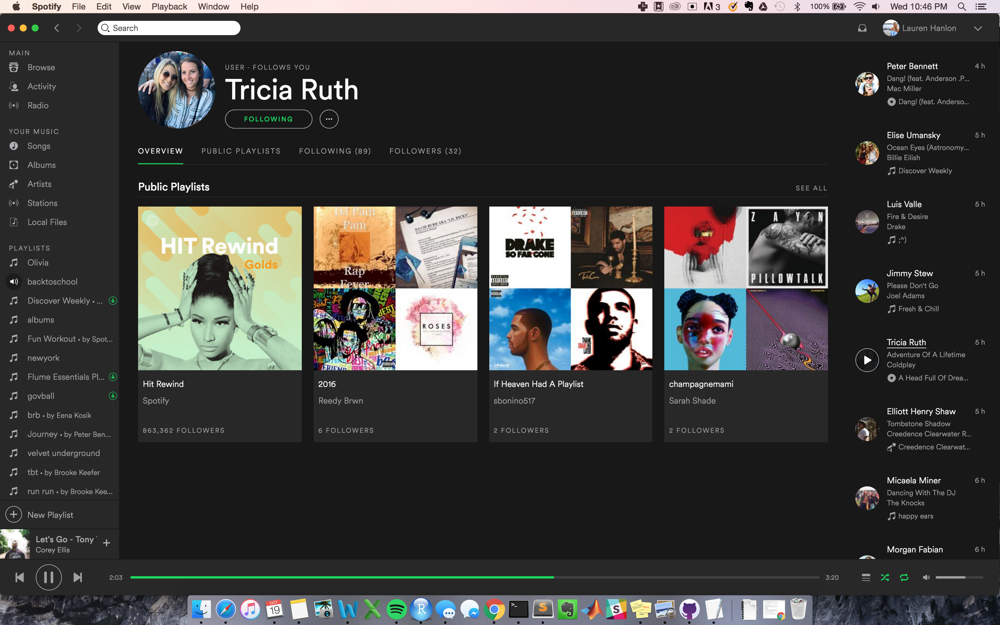

```{r setup, include=FALSE}
knitr::opts_chunk$set(echo = TRUE)
```

### Introduction

In an effort to better understand the design of Spotify and it's functionality, I conducted a series of usability tests. You can find the public GitHub repo for this project including all images [here](https://github.com/laurenhanlon/spotify_usability).

I completed three usability tests, where one person was a note-taker with a recorder and I served as the moderator. I then played back the recordings and synthesized each user's experience as well as key findings regarding Spotify's UX.

I recruited participants with different prior knowledge of the platform (from novice to premium user) to complete a series of tasks. During the three trials, I guided the user through the set of tasks, making sure to convey the task objective without providing too much guidance on how the task was to be carried out. This allowed the notetaker to keep a log of the user's stream-of-conscious commentary on their actions in addition to their navigation choices.

---

### Methodology

I focused on evaluating Spotify's functionality across several use cases: _organizing_ music, _exploring_ music, and engaging with other Spotify users in a _social_ manner. I paid close attention to how the design of the platform guided the users steps in completing the tasks and sought to identify how the experience-level of the uesr affected their navigation on the platform.

In writing out questions to ask the users, I decided to split up the questions into three different tasks: _Organization, Exploration and Social_ that could determine the different user needs within the music platform. 

---

### Test Guide

#### Logistics
- 1 moderator
- 1 notetaker/session recorder

#### Target Participant Criteria
- Tech savvy university students
- A range of experience-levels (premium user, moderate Spotify user, new user)
- Mix of premium and standard users (all operating in a premium environment)

#### Testing Goals: To determine how well Spotify addresses varying user needs
- Organization of music
- Exploration and discovery of new music
- Social engagement

#### Questions

_Organization_

1. Create a new playlist.
2. Title it.
3. Add five songs, from at least 2 different genres.
4. Put this playlist in "Offline Mode."

_Exploration_

5. Find three new songs you didn't know about. Add to playlist.

_Social_

6. Enable private session
7. Find a song from a friend's playlist and add it to your playlist from earlier.

---

### User Testing

_User One_: Experienced, premium Spotify user

_User Two_: Moderate Spotify user. Has used ocassionally but is not premium user

_User Three_: New Spotify user, minimal interaction prior to testing

#### Organization

_**Create a playlist**_

For the first task I asked all users to accompplish was making a new playlist and titling it.

The first two users (experieneced and moderate) were able to quickly location the `+ New Playlist` button on the left hand side of the platform, creating and titling the playlist with great ease. This feature seemed clearly intuitive in its design and location, allowing a user who had never opened Spotify before to accomplish the task as comfortably as the seasoned user.

The third user (new user) actually created a new playlist by clicking the upper `File` tab then selecting `New Playlist`. When reviewing the results with her, I found that the `New Playlist` button on the left hand side is not labeled very clear, and might not be as intuitive for non-Spotify users.

```{r, out.width = "300px", echo=FALSE, fig.align="center"}
knitr::include_graphics("../images/new_playlist.png")
```

_**Add 5 songs to the playlist, from two different genres**_

When browsing for songs to add to the playlist, the first user (experienced) commented that she uses the `Song` folder to store music that she likes and wants to refer back to. Thus, this is the first place she went to search for music to add to her playlist. She commented that by saving songs in this fashion, she is able to narrow the range of her search whenever she creates playlists, but that the music under `Songs` is in a sort of trial stage; not yet in a playlist, but saved in some way.

```{r, out.width = "300px", echo=FALSE, fig.align="center"}

```

The second user (moderate) did not seem to understand the role of `Songs` in the same way as the experienced user, however, she did end up browsing through `Songs` to see what was there. She ultimately added songs that were from another playlist that she guessed to be of two different genres.

When I asked the third user (new) to add songs from different genres, she went to the `Genre` tab and very straightforwardly added songs of different genres to the playlist. She found this an easy task, and added the songs quickly.

```{r, out.width = "300px", echo=FALSE, fig.align="center"}
knitr::include_graphics("../images/main_browse")
```

_**Put the playlist in offline mode**_

Putting the playlist in `Offline Mode` was straightforward for all users, regardless of experience level. They were all able to put their playlist in offline mode on the first trial. the design of this feature was very successful.

---

#### Exploration

_**Find three new songs you didn't know about and add them to your playlist**_

The experienced user instantly referred to the scrolling social notifications on the right hand side of the platform. She pulled songs from friends' playlists, commenting "oh I usually like stuff that he listens to." From this I gathered that more experienced users use social features as a shortcut to find songs that they like.

When promted to add songs to the playlist that she had never heard before, the second user (moderate) instantly went to the `Browse/Genres` portion of the platform in order to discover new songs. She browsed the `Genres` of her area, clicked on `Hip Hop` and selected two new rap songs.

The third user (new) had trouble finding new songs. After jumping around a few pages, she found new songs under the `Charts` area. This is not an ideal place to find songs if she were looking for one song in particular. She said that her first instinct was not to go to the `Search` bar.

```{r, out.width = "300px", echo=FALSE, fig.align="center"}

```

---

#### Social

_**Enable private session**_

When asked to enable a private session, all users found it intuitive to go to user profile settings in order to do so. Though not a single user accomplished this on their first trial, all three found this setting on their second attempt. They commented that the user settings drop-down menu mimicked their experiences with other social media.

_**Find a song from a friend's playlist and add it to your playlist from earlier**_

When promted, all three users understood what portions of the platform was dedicated to social interaction at a high level, even the new user. They instantly turned their attention to the rigth hand side of the interface, the activity feed, and accessed friends' accounts and playlists from there. In the subsequent section I will discuss some confusion that arose after this step, but from an organizational standpoint, the social navigation was easy to locate in the overall interface.

One comment worth nothing is that the third user (new) was confused as to which playlists were made by that user. She was unsure if they were playlists that the friend followed or made. She ended up scrolling through their profile for a while, getting frustrated, and just added a song from a different friend's playlist.

```{r, out.width = "300px", echo=FALSE, fig.align="center"}

```

---

### Problems Users Experienced 

#### Organization

The first user (experienced) was able to create and engage with her playlist with ease.

The second user (moderate) struggled with adding songs to her playlist. Creating and titling the playlist was very intuitive, however, she took a bit of time looking at `Songs` and other sections of the site such as `Browse`, attempting to get a sense of where she could access songs for a playlist. Furthermore, the plus and check buttons on the left hand side of all the song titles confused her. She switched a few checks and plusses on songs within her `Songs` section, commenting "I don't really understand what the difference between these two settings is. Is it adding anything to my playlists?" In the end, she ignored the check/plus setting because she did not see any new activity as a result. After a couple minutes of tinkering and attempting to left click to add songs, the new user was able to identify that the drag functionality was the easiest way to add songs. Once realizing all songs could be dragged onto the playlist, the rest of the task became easy. It should be noted that neither the intermediate nor experienced user struggled with this process.

The third user (new) quickly found the `New Playstli` button, but then added songs in a somewhat round-about way. Also, when she went to actually add the song to a playlist, she first clicked the check mark, but then realized that didn't work so she finally figured out how to drag and drop songs. Another problem I realized was that when she went to look at a playlist, she ended up just playing the playlist versus being able to see all songs in that playlist.

#### Exploration

I found that the more experience duser did not take advantage of the `Browse` or `Top Lists` features and relied more on social functions.

In contrast, the second user (moderate) did not understand the social elements very well and instead used the `Browse` feature to find new songs. However, these weren't necessarily songs that she would want to listen to because they were just the songs that were popular in the area.

The third (new) used the `Top Lists` feature. She did not use the `Browse` feature.

#### Social

Our experienced user mistook albums for individual songs when she was dragging in new songs from her friends' activity on the righthand side-bar. This occured two times before she realized what was happening, leader her to have to delete many songs from her playlist.

THe third user (new) had trouble finding playlists created by her friends. She scrolled through countless playlists trying to see if Spotify or her friends made them. She got frustrated.

---

#### Resulting Recommendations

I noticed that people fall into patterns within the platform that lead them to under utilize all of Spotify's capabilities. While ambiguity in usage is potive when it allows the user to interpret the interface on their own and manage it in a way that feels comforable, I feel that this reults in missed opportunities within the application.

Differentiating songs, artists and albums could be clearer. Multiple users mistook a song and album name and ended up deleting extra songs from their playlist. Creating a design guide where artistis, albums and songs are differentiated in formatting could help the user maintain a sense of order.

Conduct follow-up tests to compare the mobile application funcationality next to the desktop.


